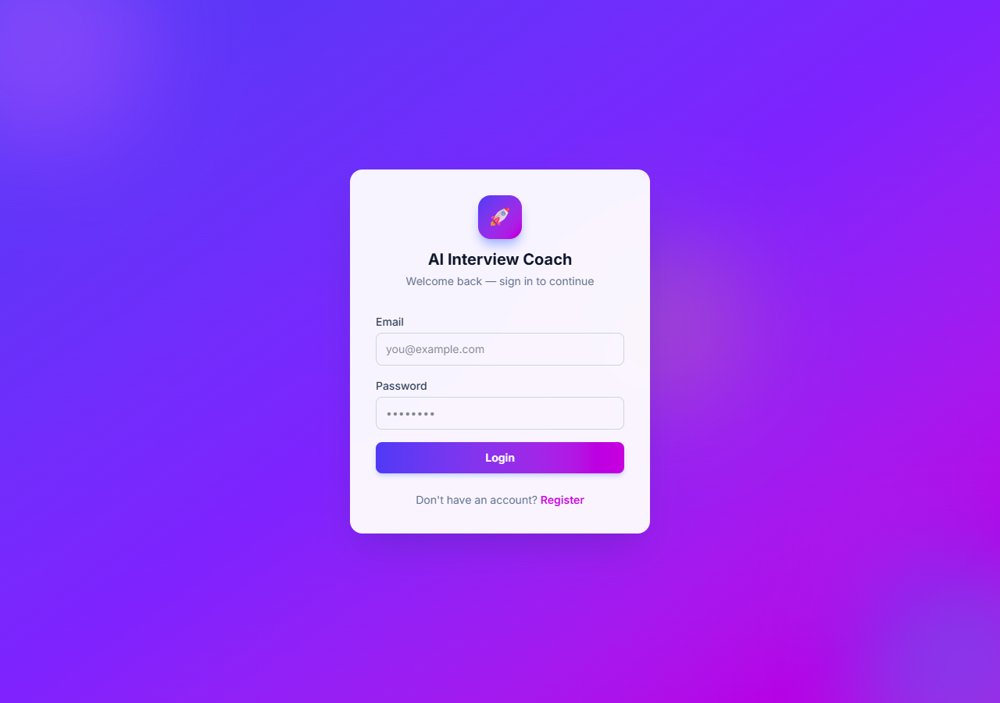
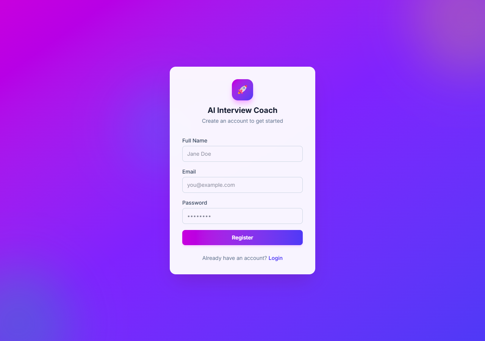
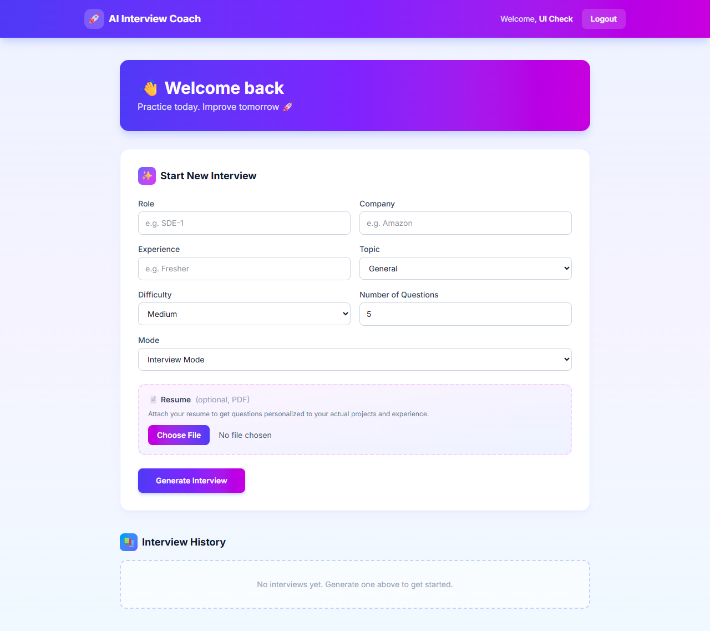

# 🤖 AI Interview Coach

An AI-powered interview preparation platform that helps users practice technical and HR interviews with instant AI feedback, detailed evaluation reports, and a dedicated learning mode — now with resume-personalized questions powered by a retrieval-augmented generation (RAG) pipeline.

**🔗 Live demo:** https://ai-interview-coach-psi-one.vercel.app
_(hosted on Vercel + Render's free tier — the backend spins down when idle, so the first request after a while can take ~30-60s to wake up)_

---

## ✨ Features

### 🎤 Interview Mode
- Generate AI interview questions based on:
  - Role
  - Company
  - Experience
  - Topic
  - Difficulty
- Answer questions one by one
- Receive AI-generated evaluation
- Detailed feedback for every answer
- Ideal answers for improvement
- Score analysis with charts
- Interview history with multiple attempts
- Retake same interview
- Generate new interview

### 🧠 Resume-Personalized Questions (RAG)
- Attach a PDF resume when starting an interview
- The resume is extracted, chunked, and embedded (Gemini `gemini-embedding-001`)
- Chunks are stored in MongoDB Atlas Vector Search
- When generating questions, the most relevant resume sections are retrieved and woven into the prompt
- Result: questions that reference your actual projects, technologies, and experience — not generic ones

### 📖 Learning Mode
- Learn interview questions without evaluation
- View AI-generated ideal answers
- Save learning sessions
- Review previously learned questions

### 📊 Dashboard
- Interview history
- Previous reports
- Multiple attempts
- Average score
- Latest score
- Attempt duration
- Performance chart
- Delete interview history

### 🔐 Authentication
- User Registration
- User Login
- JWT Authentication (verified server-side on every protected route)
- Protected Routes

---

## 🛠 Tech Stack

### Frontend
- React 19 + TypeScript
- Vite
- React Router
- Tailwind CSS
- Axios
- Recharts

### Backend
- Python + FastAPI
- Beanie (async MongoDB ODM) + PyMongo (async client)
- PyJWT, bcrypt
- Uvicorn

### Database
- MongoDB Atlas + MongoDB Atlas Vector Search (for the RAG resume pipeline)
- PostgreSQL (SQLAlchemy async, via Neon) — relational analytics store

### AI
- Google Gemini API — `gemini-flash-latest` for question generation & evaluation, `gemini-embedding-001` for embeddings

---

## 🏗 Architecture: why two databases

The app deliberately uses both a document store and a relational store, for different jobs:

- **MongoDB** is the system of record for interviews — a naturally nested, evolving shape (an interview has many attempts, each attempt has many answers) that doesn't need joins to read back.
- **PostgreSQL** holds a normalized analytics layer (`interview_summaries` → `question_scores`, linked by a foreign key), populated on every submission. This is where aggregate questions get answered with real SQL — average score by topic, weakest-scoring questions across attempts — via `GROUP BY`/`JOIN` queries rather than post-processing documents in application code.

The analytics write is intentionally best-effort and non-blocking: a Postgres hiccup never breaks interview submission, since MongoDB remains the source of truth. See `app/sql/` and `GET /api/analytics/overview` in `backend-fastapi`.

---

## 📂 Project Structure

```
AI-Interview-Coach-V2
│
├── frontend-ts
│   ├── src
│   │   ├── components
│   │   ├── pages
│   │   ├── services
│   │   └── types
│   └── ...
│
├── backend-fastapi
│   ├── app
│   │   ├── routers
│   │   ├── models
│   │   ├── schemas
│   │   ├── dependencies
│   │   └── utils
│   ├── scripts
│   └── requirements.txt
│
└── README.md
```

---

## 🚀 Installation

### Clone Repository

```bash
git clone <this-repository-url>
```

### Backend (`backend-fastapi`)

```bash
cd backend-fastapi
python -m venv .venv
.venv\Scripts\activate      # Windows
# source .venv/bin/activate  # macOS/Linux

pip install -r requirements.txt
```

Create a `.env` file (see `.env.example`) with:

```
PORT=8000
MONGO_URI=<your MongoDB Atlas connection string>
JWT_SECRET=<a strong random secret>
GEMINI_API_KEY=<your Gemini API key>
```

One-time setup — create the Atlas Vector Search index used by the RAG feature:

```bash
python scripts/create_vector_index.py
```

Run the server:

```bash
uvicorn app.main:app --host 0.0.0.0 --port 8000
```

Interactive API docs are available at `http://localhost:8000/docs`.

### Frontend (`frontend-ts`)

```bash
cd frontend-ts
npm install
```

Create a `.env` file (see `.env.example`) with:

```
VITE_API_URL=http://localhost:8000/api
```

Run the dev server:

```bash
npm run dev
```

---

# 📸 Application Screenshots

## 🏠 Login Page



---

## 📝 Register Page



---

## 📊 Dashboard



---

## 🔮 Future Enhancements

- Voice-based interviews
- AI speech analysis
- Video interview support
- Company-wise interview sets

---

## 👩‍💻 Author

**Varshini Reddy**

GitHub:
https://github.com/Varshini-ReDDyY

LinkedIn:
https://www.linkedin.com/in/varshini-reddy-18a9442a4

---

⭐ If you like this project, consider giving it a star.
